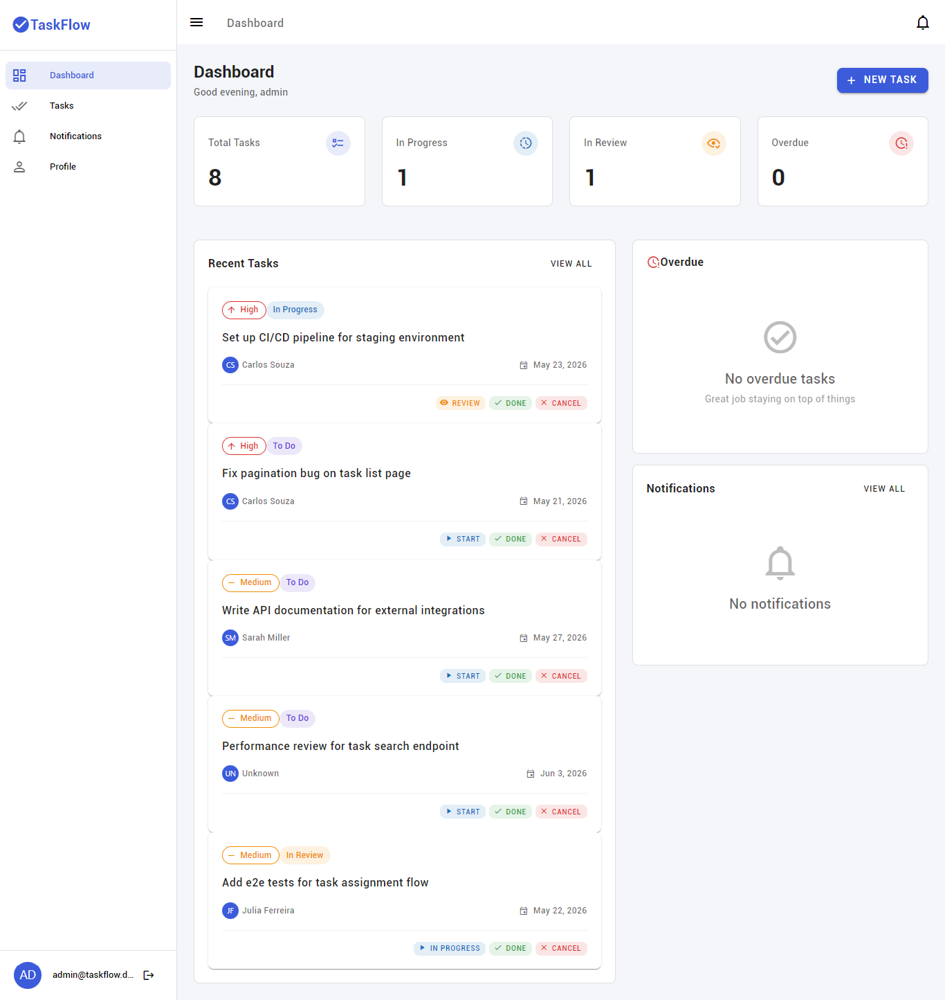
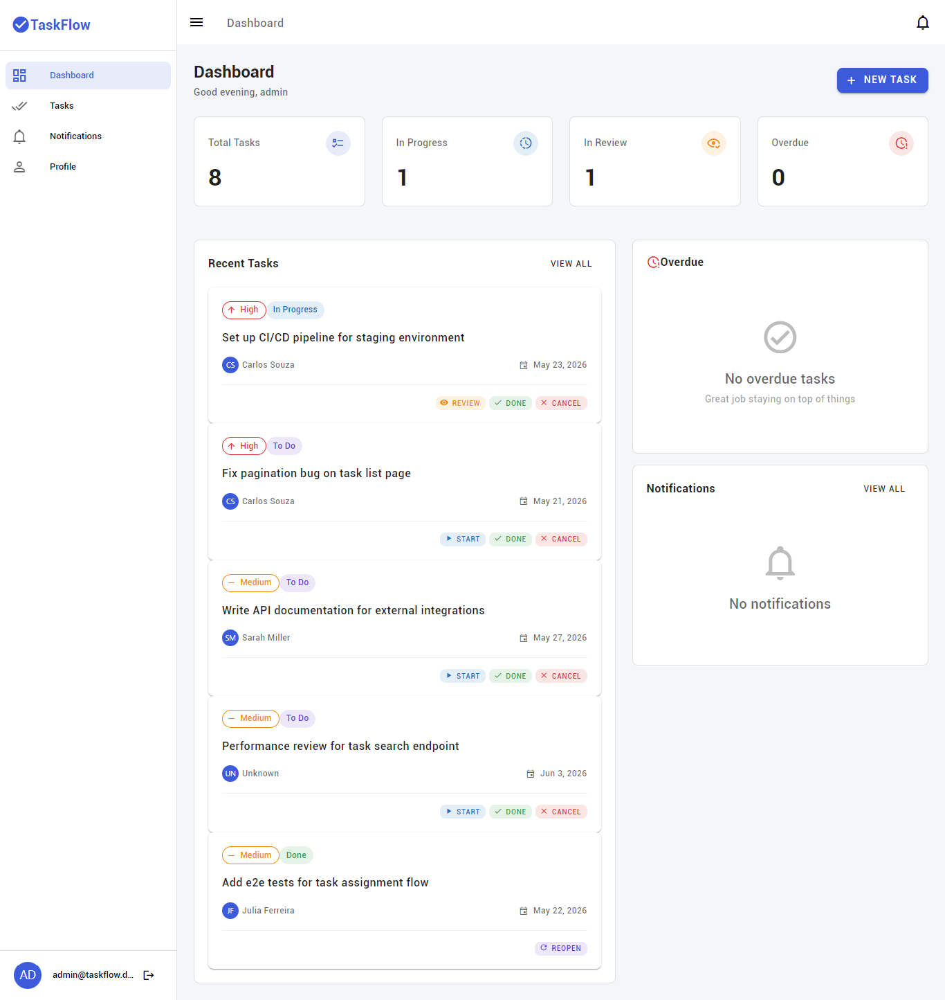
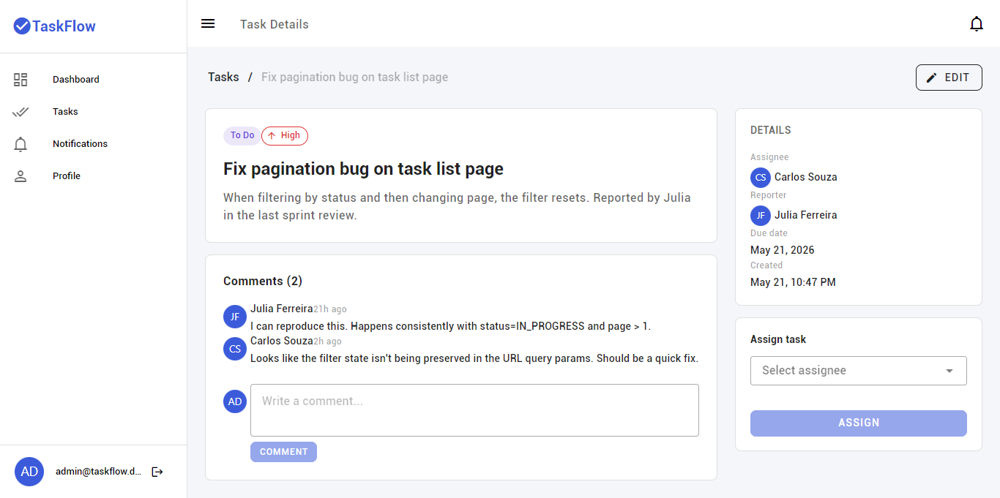
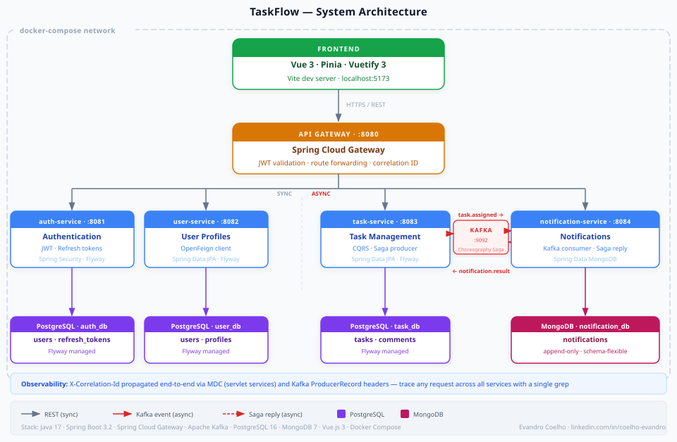

# TaskFlow

A collaborative task management platform built with Java microservices.

Designed to demonstrate practical backend architecture using real-world patterns: event-driven choreography saga, lightweight CQRS, distributed observability, and polyglot persistence — all running locally with a single `docker-compose up`.

**Author:** Evandro Coelho · [coelho.g.evandro@gmail.com](mailto:coelho.g.evandro@gmail.com) · [linkedin.com/in/coelho-evandro](https://www.linkedin.com/in/coelho-evandro/)

---

## Screenshots

**Dashboard** — live stats, recent tasks and overdue alerts in one view



**Task list** — contextual quick-action buttons change based on current status (Start, Review, Done, Cancel, Reopen)



**Task detail** — full task view with comments, assignee and status controls



---

## Architecture



Six independently deployable services, each owning its own database. No shared tables, no direct cross-service DB connections. Synchronous communication via REST; asynchronous via Kafka.

```
┌─────────────────────────────────────────────────────────┐
│                    Frontend (Vue 3)                     │
└──────────────────────────┬──────────────────────────────┘
                           │ HTTPS / REST
┌──────────────────────────▼──────────────────────────────┐
│              API Gateway  :8080                         │
│    Spring Cloud Gateway · JWT validation · routing      │
└──────┬──────────┬──────────────┬───────────────┬────────┘
       │          │              │               │
       ▼          ▼              ▼               ▼
  auth-service  user-service  task-service  notification-service
    :8081         :8082          :8083           :8084
  (PostgreSQL)  (PostgreSQL)  (PostgreSQL)    (MongoDB)
                                  │  ▲
                        task.assigned│
                    notification.result│  (Kafka)
                                  ▼  │
                        notification-service
                          (async consumer)
```

---

## Services

### auth-service
Handles registration, login, token issuance and refresh. Nothing else.

JWT access tokens expire in 15 minutes. Refresh tokens last 7 days and are stored in the database so they can be revoked.

### user-service
Stores user profiles (name, email, job title, department). Auth-service handles passwords and tokens; user-service handles everything about the person.

Exposes a Feign client that other services use to validate users without coupling to auth.

### task-service
The core of the application. Tasks can be created, assigned, updated and commented on.

Uses a lightweight CQRS approach — commands (`CreateTaskCommand`, `AssignTaskCommand`, `UpdateTaskStatusCommand`) go through dedicated handlers; queries go through `TaskQueryService` with optimized projections. This keeps write logic clean and makes reads easy to optimize independently.

When a task is assigned, task-service emits a `task.assigned` Kafka event. It doesn't care what happens next — that's the point of event-driven design.

### notification-service
Consumes `task.assigned` from Kafka, creates a notification in MongoDB, then emits `notification.result`. Implements the saga compensation path: if the assignee no longer exists, it emits a failure result that causes task-service to roll back the assignment.

MongoDB was chosen because notifications are append-only, schema-flexible, and queries are simple (by user ID).

### gateway-service
Single entry point for all clients. Validates JWT tokens locally (no round-trip to auth-service) before forwarding requests. Route config lives in `application.yml`.

No service discovery. With five services in Docker Compose, environment-variable hostnames are simpler and more transparent than Eureka or Consul.

---

## Saga Pattern (Choreography)

```
1. POST /tasks/{id}/assign
   → task-service validates the task and records assignment (PENDING_NOTIFICATION)
   → emits: task.assigned  [Kafka]

2. notification-service consumes task.assigned
   → calls user-service to verify the assignee still exists
   → OK:  creates notification, emits notification.result { success: true }
   → NOK: emits notification.result { success: false }  ← compensation

3a. task-service receives notification.result (success)
    → updates assignmentStatus → CONFIRMED

3b. task-service receives notification.result (failure)
    → rolls back: assigneeId = null, assignmentStatus = UNASSIGNED
```

Choreography was chosen over orchestration because the flow has three steps and no complex branching. An orchestrator (Temporal, AWS Step Functions) would make sense at six or more steps.

---

## CQRS (Lightweight)

Applied only in task-service, only where it adds value:

- **Commands** — `CreateTaskHandler`, `AssignTaskHandler`, `UpdateTaskStatusHandler`: one class per operation, responsible for validation and state mutation.
- **Queries** — `TaskQueryService`: optimized projections, filtering by status/assignee, pagination.

No event sourcing. No separate read store. The boundary is purely code organisation, not infrastructure.

---

## Observability

Every request gets an `X-Correlation-Id` UUID that travels through the entire system.

```
Browser → Gateway (CorrelationIdWebFilter)
            generates UUID, adds to response header

       → task-service (CorrelationIdFilter)
            extracts header into MDC
            all logs: [cid=<uuid>]

       → Kafka: task.assigned
            AssignTaskHandler writes correlationId as ProducerRecord header

       → notification-service (TaskEventConsumer)
            extracts header from ConsumerRecord
            sets MDC, propagates cid in notification.result reply header

       → task-service (SagaEventConsumer)
            extracts header, sets MDC
            saga logs share the same cid
```

Log format across all services:
```
HH:mm:ss.SSS LEVEL [service-name] [cid=<uuid>] [uid=<uuid>] Logger — message
```

Trace a full assignment flow:
```bash
docker-compose logs | grep "cid=<your-uuid>"
```

**Gateway note:** Spring Cloud Gateway is reactive (WebFlux). MDC doesn't propagate in reactive pipelines, so the gateway logs the correlation ID inline rather than via MDC. All other services are servlet-based and use standard SLF4J MDC.

---

## Tech Stack

| Layer | Technology |
|---|---|
| Language | Java 17 |
| Framework | Spring Boot 3.2 |
| Gateway | Spring Cloud Gateway (WebFlux) |
| Auth | Spring Security + JWT (JJWT) |
| ORM | Spring Data JPA (Hibernate 6) |
| HTTP Client | OpenFeign |
| Messaging | Apache Kafka |
| Relational DB | PostgreSQL 16 |
| Document DB | MongoDB 7 |
| Migrations | Flyway |
| Frontend | Vue 3 · Vuetify 3 · Pinia · Vite |
| Containers | Docker · Docker Compose |
| Build | Maven |

---

## Running Locally

**Prerequisites:** Docker and Docker Compose.

```bash
git clone https://github.com/evandrocoelho/taskflow.git
cd taskflow
docker-compose up --build
```

First startup takes a few minutes while images build and services initialise. Services start in dependency order (Postgres → Kafka → backend services → frontend).

Once running:

| Service | URL |
|---|---|
| Frontend | http://localhost:5173 |
| API Gateway | http://localhost:8080 |
| auth-service | http://localhost:8081 |
| user-service | http://localhost:8082 |
| task-service | http://localhost:8083 |
| notification-service | http://localhost:8084 |

**Demo accounts (seeded via Flyway + pgcrypto):**

| Email | Password | Role |
|---|---|---|
| admin@taskflow.dev | admin123 | ADMIN |
| sarah.pm@taskflow.dev | user123 | USER |
| carlos.dev@taskflow.dev | user123 | USER |
| julia.qa@taskflow.dev | user123 | USER |

---

## API

Import `postman/TaskFlow.postman_collection.json` into Postman.

The collection includes:
- Auto-saved `accessToken` and `refreshToken` on every login
- Reusable `taskId` variable (saved on create / list)
- Pre-built test assertions for every request
- **Saga Demo** folder — four ordered requests that demonstrate the full Kafka choreography flow with console output

Quick test via curl:
```bash
# Login
curl -s -X POST http://localhost:8080/api/auth/login \
  -H "Content-Type: application/json" \
  -d '{"email":"admin@taskflow.dev","password":"admin123"}' | jq .

# List tasks (use token from above)
curl -s http://localhost:8080/api/tasks \
  -H "Authorization: Bearer <access_token>" | jq .
```

---

## Project Structure

```
taskflow/
├── auth-service/           # JWT auth, registration, token refresh
│   └── src/main/resources/db/migration/  # Flyway: V1 schema, V2 seed (pgcrypto)
├── user-service/           # User profiles, Feign client
├── task-service/           # Core domain: CQRS handlers, Saga producer/consumer
│   └── src/main/resources/db/migration/  # Flyway: V1 schema, V2 seed, V3 varchar migration
├── notification-service/   # Kafka consumer, MongoDB storage, Saga reply
├── gateway-service/        # Spring Cloud Gateway, JWT filter, correlation ID
├── frontend-app/           # Vue 3 SPA (Vuetify 3, Pinia, Vite)
├── docs/
│   ├── architecture.svg    # System design diagram
│   └── screenshots/        # UI screenshots
├── postman/
│   └── TaskFlow.postman_collection.json
└── docker-compose.yml
```

---

## Design Decisions

**Why not Eureka/Consul for service discovery?**
Five services in Docker Compose don't need it. Environment variables with container hostnames are simpler and fully transparent. Moving to Kubernetes adds service discovery at the platform level.

**Why JWT validation in the gateway, not per-service?**
The gateway validates locally using the shared secret — no network hop, no dependency on auth-service being healthy for every request.

**Why MongoDB for notifications?**
Notifications are append-only, never joined with other entities, and different notification types have different payloads. A document store fits better than a relational table here.

**Why choreography saga instead of orchestration?**
Three-step flow with one branching point. An orchestrator adds infrastructure (another service, another DB, another failure mode) without meaningful benefit at this scale.

**Why not Spring Cloud Config?**
`docker-compose.yml` environment variables are sufficient for a five-service local setup. A config server becomes worth it when you have multiple environments and frequent config changes across many services.

---

## Roadmap

### Phase 1 (complete)
- [x] Six-service microservices backend
- [x] Vue 3 frontend with real-time status updates
- [x] JWT authentication with refresh token rotation
- [x] Apache Kafka event-driven communication
- [x] Choreography-based saga with compensation
- [x] Lightweight CQRS in task-service
- [x] Polyglot persistence (PostgreSQL + MongoDB)
- [x] Flyway database migrations with pgcrypto seeding
- [x] Docker Compose with health checks and dependency ordering
- [x] Structured logging with correlation ID across all services and Kafka events

### Phase 2 (planned)
- [ ] OpenTelemetry + Jaeger distributed tracing
- [ ] Prometheus metrics + Grafana dashboard
- [ ] End-to-end tests (Testcontainers)

---

## License

MIT — [Evandro Coelho](https://www.linkedin.com/in/coelho-evandro/)
